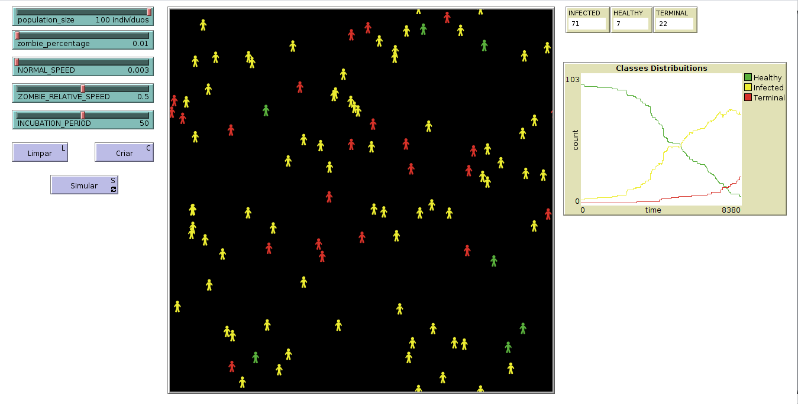

# ☣️ Humans vs. Zombies ☣️
> _Um sistema multiagente para simulação epidemiológica_

## O que é?

Este é um modelo construído em [NetLogo](https://ccl.northwestern.edu/netlogo/) para representar a epidemia de um vírus hipotético responsável por mutar o código genético do infectado transformando-o em um indivíduo infectado em estado terminal, aqui referido como **zumbi**.

## Como funciona

Como a contaminação de vírus comuns, neste modelo ela é mais provável em áreas mais densamente povoadas. Portanto, a transmissão ocorre quando há um contato direto entre o infectado e um humano saudável.

## Como utilizar

Abrir com o NetLogo e clicar em Criar para construir o ambiente. Outros comandos incluem:
 + **Criar** cria uma população conforme configurado nos _sliders_;
 + **Simular** inicia a simulação. Clique novamente para pausá-la;
 + **Limpar** elimina todos os agentes.

## Coisas a observar

+ Indivíduos saudáveis (sem o vírus) são marcados em verde.
+ Indivíduos em período de incubação podem **transmitir** o vírus, mas ainda não apresentam sintomas. Estes são marcados em amarelo.
+ Indivíduos em estado crítico de infecção são classificados como **zumbis** e apresentam os sintomas. Eles **perseguem e infectam** indivíduos saudáveis próximos. Estes são marcados em vermelho.
+ Os sintomas da doença incluem, além da pele avermelhada, uma drástica redução na mobilidade do indivíduo, o que pode retardar a epidemia.

## Coisas a experimentar

+ Iniciar com um único zumbi e observar as curvas de infectados e população zumbi crescendo.
+ Avaliar o tempo de convergência para infectados com uma população maior.

## Estendendo o modelo

+ Futuras melhorias podem incluir elementos como instinto de **fuga** e **gasto energético** entre humanos.
+ Elementos de **combate físico** que eliminem zumbis também podem ser adicionados na dinâmica, para dar uma chance de sobrevida aos mortais.
+ Uma vez que exista o combate físico, faz sentido que humanos formem **grupos** para proteger uns aos outros de forma eficiente.
+ Em uma simulação de maior escala incluir estratégias de combate ao vírus, como o desenvolvimento de uma **cura** através de pesquisas e de **zonas de quarentena**.

## Detalhes de implementação

Há uma peculiaridade na implementação deste modelo que, pela falta de uma forma melhor não ter sido encontrada, o modo com que um zumbi "caça" um humano saudável segue uma lógica inversa. Nesta versão do modelo é o humano saudável que "chama" um zumbi próximo, se existente. Apesar desta solução alternativa, o efeito resultante é o mesmo. De outro ponto de vista, pode-se assumir que o ser humano saudável chama o zumbi por um odor característico de uma cadeia proteica ausente ou inibida em indivíduos infectados.

## Captura de tela

